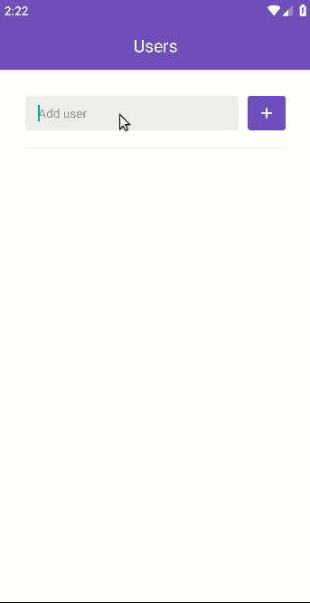

<h1 align="center">
	bootcamp-gostack-desafio06
</h1>

<h3 align="center">
  Challenge 6: Introduction to React Native
</h3>

<p align="center">
  
</p>

A simple React application that creates an interface and gets information from **GitHub Api**.
App shows users' starred repositories.

#### Application screen



## Technologies

- [NodeJS 10.16.3](https://nodejs.org/)
- [ReactJS 16.9.0](https://reactjs.org/)
- [React Native 0.60.5](https://facebook.github.io/react-native/)

## Run

```bash
# After clone the project
$ cd bootcamp-gostack-desafio06

# Install packages
$ yarn install
# or
$ npm install

# Run the app -> you need an Android device or emulador installed
$ react-native start
# and in another terminal in the project folder
$ react-native run-android

```

_Note.: this app has not been tested on iOS device_

---

This is part of my [GoStack](https://rocketseat.com.br/bootcamp) training
